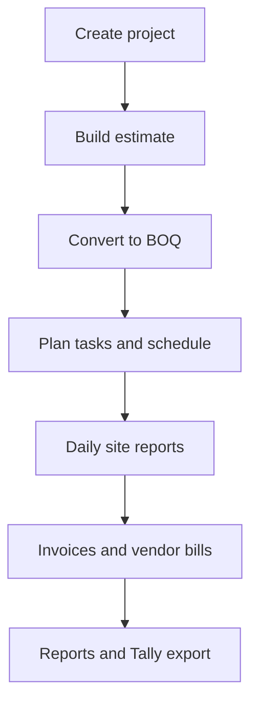

# BuildFlow — Business Guide

**For company owners, directors, and non-technical decision-makers**

BuildFlow is a construction management platform for Indian civil engineering and contracting firms. It connects **estimation, planning, site operations, and accounting** in one place — usable on **mobile, tablet, and desktop web**.

Product by **Jora AI** · [jora.co.in](https://jora.co.in)

---

## What BuildFlow helps you do

| Area | What you get |
|------|----------------|
| **Projects** | Create and track construction projects with budget, status, and team visibility |
| **Estimation & BOQ** | Build cost estimates, use rate templates, compare versions, convert to BOQ — see [Estimates guide](./ESTIMATES.md) |
| **Planning** | Schedule tasks, dependencies, and monitor progress vs plan |
| **Daily site reports** | Supervisors log work done, materials, photos, and check-ins from site |
| **Accounting** | Invoices to clients, bills from vendors, GST, TDS, payment tracking |
| **Reports & analytics** | Financial summaries, PDF exports, owner dashboard |
| **BuildFlow Assistant** | Ask questions about project status, overdue tasks, invoices, GST/TDS basics |

---

## Who uses BuildFlow (roles)

Each person in your company gets a login with a **role**. The role controls what they can see and change.

| Role | Typical person | Main access |
|------|----------------|-------------|
| **Owner** | Director / company head | Full access: settings, billing, users, integrations, audit log, all modules |
| **PM** (Project Manager) | Project manager | Projects, estimation, planning, reports, accounting (no company settings) |
| **Supervisor** | Site engineer / supervisor | Dashboard, projects (site view), daily reports |
| **Accountant** | Accounts / finance | Dashboard, accounting, reports |

**Rule of thumb:** Only the **Owner** manages company-wide settings, subscriptions, integrations, and team invites.

---

## How a new company gets started

### Step-by-step

1. **Visit the BuildFlow website** — landing page, pricing, and about sections explain the product.
2. **Start a trial** — the company owner registers with company details (name, GSTIN, state, etc.). **No credit card is required** at signup.
3. **14-day free trial** — full access to core features during the trial period.
4. **Invite your team** — Owner goes to **Settings → Users & Roles** and sends email invites. Each invitee chooses their role (PM, Supervisor, or Accountant).
5. **Team members join** — they open the invite link, set a password, and land in the app.
6. **Before trial ends** — Owner reviews **Settings → Billing & plan** to upgrade or contact support.

---

## Day-to-day workflows

### 1. Run a project (end-to-end)

| Step | Who usually does it | Where in the app |
|------|---------------------|------------------|
| Create a project | Owner or PM | **Projects → Create** |
| Prepare estimate | PM | **Estimation** (company-wide or inside a project) |
| Use templates | PM | Pre-made estimate items; adjust quantities and rates |
| Convert to BOQ | Owner (after approval) | From approved estimate on project **Estimate** tab |
| Schedule work | PM | **Planning** — tasks, dependencies, progress |
| Site updates | Supervisor | **Reports** — daily report, check-in, photos |
| Raise invoice to client | PM or Accountant | **Accounting → Invoices** |
| Record vendor bill | Accountant | **Accounting → Bills** |
| Review finances | Owner / Accountant | **Accounting**, **Reports**, **Dashboard** |

### 2. Estimation workflow

Estimates are **project cost plans**: sections and line items rolled up with overhead, contingency, profit, and GST. They go through **draft → review → approval** before the Owner converts them to BOQ.

**Full guide:** [How BuildFlow Estimates Work](./ESTIMATES.md) — templates, totals, approval rules, versioning, and BOQ conversion.

**Short version:**

1. Open a **project** → **Estimate tab** (or **Estimation** menu for rate libraries).
2. **Create estimate** — 3 steps: setup (name, margins), build (sections + lines or template), review.
3. **PM submits** for review; **Owner approves** or rejects with a reason.
4. **Compare versions** when you have multiple drafts or revisions.
5. When **approved**, **Owner converts to BOQ** — project budget updates; team executes on the BOQ tab.

Only **DRAFT** or **REJECTED** estimates can be edited; duplicate an approved estimate to create the next version.

### 3. Site supervision workflow

1. Supervisor opens **Reports** for their project.
2. Submits a **daily report**: work completed, materials used, issues, photos.
3. Uses **check-in** where location/maps is configured (optional).
4. PM and Owner see updates on the dashboard and project view.

### 4. Accounting workflow (India-focused)

1. **Invoices (money in)** — create from a project, apply GST, send to client. Optional **payment link** if Razorpay is configured (see Integrations).
2. **Bills (money out)** — record vendor bills, GST, TDS where applicable.
3. **Tally export** — export project invoices and bills as Tally-compatible XML (ledger names can be mapped in Integrations).
4. **Journal entries** — created automatically for key payment events when integrations are active.

### 5. Variations (change orders)

When scope or quantities change after BOQ is frozen, **PM** creates a **Variation** on the project tab, **Owner approves**, and BOQ plus **budget** update automatically.

### 6. Running Account (RA) billing

Create **Running Account** invoices with certified BOQ quantities, retention %, and cumulative totals; export **RA bill PDF** and **measurement book** for audit.

### 7. Procurement & subcontractors

**Indent → PO → GRN** on the Procurement tab updates site stock. **Subcontract work orders** with measurement sheets can auto-create linked bills on approval.

### 8. Client portal & project access

Generate **client portal links** (progress, invoices, pay). Assign **project members** so PMs and supervisors only see their projects.

### 9. Using the BuildFlow Assistant

- Available via the **floating assistant button** (bottom-right on web and mobile).
- Ask in English or Hinglish: project status, overdue tasks, outstanding invoices, estimate vs actual, basic GST/TDS questions.
- Answers use **your live project data** where available.

---

## Settings & company administration (Owner)

| Setting | Purpose |
|---------|---------|
| **My Profile** | Update your name and phone; request role/email changes via support ticket |
| **Support requests** | Submit and track change requests (profile, billing, integrations, bugs) |
| **Company Profile** | Company name, GSTIN, PAN, address, logo |
| **Users & Roles** | Invite, revoke, and manage team access |
| **Billing & plan** | Trial status, upgrade plan, payment (when online checkout is enabled) |
| **Material Prices** | Company resource library and rates |
| **Rate Analysis Library** | BOQ rate templates for estimators |
| **Manage Integrations** | Connect your company’s payment, WhatsApp, Tally, Maps, etc. |
| **Audit Log** | Who changed what in the company (compliance and oversight) |
| **Data Export** | Download a backup of company data |

---

## Integrations — explained for business heads

Integrations fall into **two buckets**. This matters for contracts, GST, and who pays whom.

### Your company’s integrations (you configure)

These use **your firm’s accounts** — for talking to **your clients and vendors**, not for paying BuildFlow.

| Integration | Business use |
|-------------|----------------|
| **WhatsApp & SMS (Twilio)** | Send invoice links and reminders to **your clients** |
| **Razorpay** | **Your clients** pay **your invoices** online (India) |
| **Stripe** | International client payments on **your invoices** |
| **Tally** | Map ledger names so exports match **your books** |
| **Google Maps** | Site location, navigation, attendance check-in |
| **AI Assistant (optional BYOK)** | Use your own AI provider instead of BuildFlow’s default |
| **File storage (optional BYOK)** | Store uploads in **your own** cloud bucket |

**Who sets these up:** Company **Owner** under **Settings → Manage Integrations**.  
**If you need help:** Use **Support requests → Integration setup** (BuildFlow team can assist on escalated tickets).

### BuildFlow platform services (Jora AI / BuildFlow team)

These run the product itself. Your team does **not** configure these in Integrations.

| Service | Purpose |
|---------|---------|
| Hosting & database | Keeps your data secure and available |
| BuildFlow Assistant (default) | AI help unless you override with your own LLM |
| File storage (default) | Logos and site photos unless you use your own S3 |
| **BuildFlow subscription billing** | You pay **BuildFlow** for the software plan (separate from Razorpay for client invoices) |
| Platform admin | BuildFlow internal team manages trials, escalations, and enterprise accounts |

**Important:** Paying a client through **your Razorpay** in Integrations is **not** the same as paying **BuildFlow** for your monthly subscription. Subscription is under **Settings → Billing & plan**.

---

## Support requests (tickets)

Anyone can raise a request; the Owner resolves company-level items.

| Category | Example |
|----------|---------|
| Profile / role change | “Make me PM on all projects” |
| Company info change | GSTIN or address update request |
| Integration setup | “Help connect WhatsApp Business” |
| Billing & subscription | Extend trial, upgrade plan, invoice query |
| Bug report | Something not working |
| Data correction | Fix wrong figures or records |
| Other | General questions |

- **Company scope** — handled by your Owner (or forwarded internally).
- **Platform scope** — escalated to **BuildFlow support** (billing, integration help from BuildFlow team).

---

## Subscription & pricing (BuildFlow plans)

| Plan | Indicative price | Best for |
|------|------------------|----------|
| **Starter** | ₹4,999 / month | Small contractors, up to 3 projects |
| **Professional** | ₹12,999 / month | Growing firms, full accounting & planning |
| **Enterprise** | Custom | Large firms, dedicated support, custom integrations |

- **14-day free trial** on signup (no card required).
- Reminders are sent as the trial nears expiry (7, 3, and 1 day).
- **Upgrade:** Settings → Billing & plan (online checkout when enabled by BuildFlow ops, otherwise submit a billing request).

---

## Public website vs logged-in app

| Area | Audience | Content |
|------|----------|---------|
| **Landing page** | Prospects | Features, testimonials, call-to-action |
| **Pricing page** | Prospects | Plans and comparison (separate page for tracking interest) |
| **About** | Prospects | Company story and product vision |
| **Start trial / Sign up** | New owners | Company registration |
| **Login** | Existing users | Email and password |
| **Invite signup** | Invited team | Join via owner’s invite link only |

---

## BuildFlow internal admin (not for construction companies)

BuildFlow/Jora AI staff use a separate **Platform Admin** console to:

- View all customer companies and subscription status
- Extend trials or change plans
- Handle escalated support tickets
- See read-only integration status per company (no secret keys)

Construction company owners **do not** use this console.

---

## What is complete vs still being polished

| Status | Areas |
|--------|--------|
| **Ready for use** | Login, trials, invites, projects, estimation, BOQ, planning, daily reports, accounting (GST/TDS), notifications, assistant, integrations UI, billing screen, tickets, audit log, data export, marketing site |
| **In progress (Phase 6)** | Further reports, analytics polish, and UX refinements across desktop and mobile |

For a production rollout, plan a short **pilot on 1–2 real projects** with Owner + PM + Supervisor + Accountant before company-wide adoption.

---

## Demo access (for evaluation)

When using the sample/demo environment:

| Role | Email | Password |
|------|-------|----------|
| Owner | owner@reddyconst.com | Test@1234 |
| PM | pm@reddyconst.com | Test@1234 |
| Supervisor | site@reddyconst.com | Test@1234 |
| Accountant | accounts@reddyconst.com | Test@1234 |
| BuildFlow platform admin | admin@buildflow.com | Admin@1234 |

**Sample company:** Reddy Constructions Pvt Ltd (Hyderabad)

---

## Quick reference — “Who do I ask?”

| Question | Ask |
|----------|-----|
| Add/remove team members | Company **Owner** (Settings → Users) |
| Change my role or email | Submit **Support request**; Owner or BuildFlow approves |
| Connect WhatsApp / Razorpay for **our clients** | Company **Owner** (Integrations) or Integration setup ticket |
| Pay for **BuildFlow software** | Company **Owner** (Billing) or BuildFlow sales |
| Wrong invoice or bill amount | **Accountant** or PM; Owner for audit trail |
| Site not reporting daily | **Supervisor** + PM follow-up |
| Trial extension or enterprise pricing | **Owner** → Billing request → BuildFlow support |

---

## Summary

BuildFlow is designed so a **construction company head** can:

1. **Start on a trial** without IT setup.
2. **Invite the right people** with clear roles.
3. **Run projects** from estimate → plan → site → invoice in one system.
4. **Keep finance GST-aware** and export to Tally when ready.
5. **Connect own payment and WhatsApp** accounts for client communication.
6. **Stay in control** via audit log, exports, and owner-only settings.

For technical setup (servers, API keys, deployment), refer your IT team to the developer **README** in the project repository.

---

*Last updated: June 2026 · Reflects current product capabilities including company integrations, SaaS billing UI, support tickets, and platform admin.*
