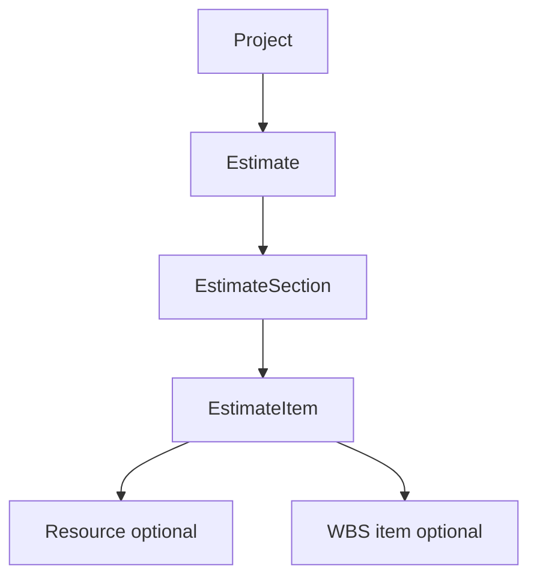
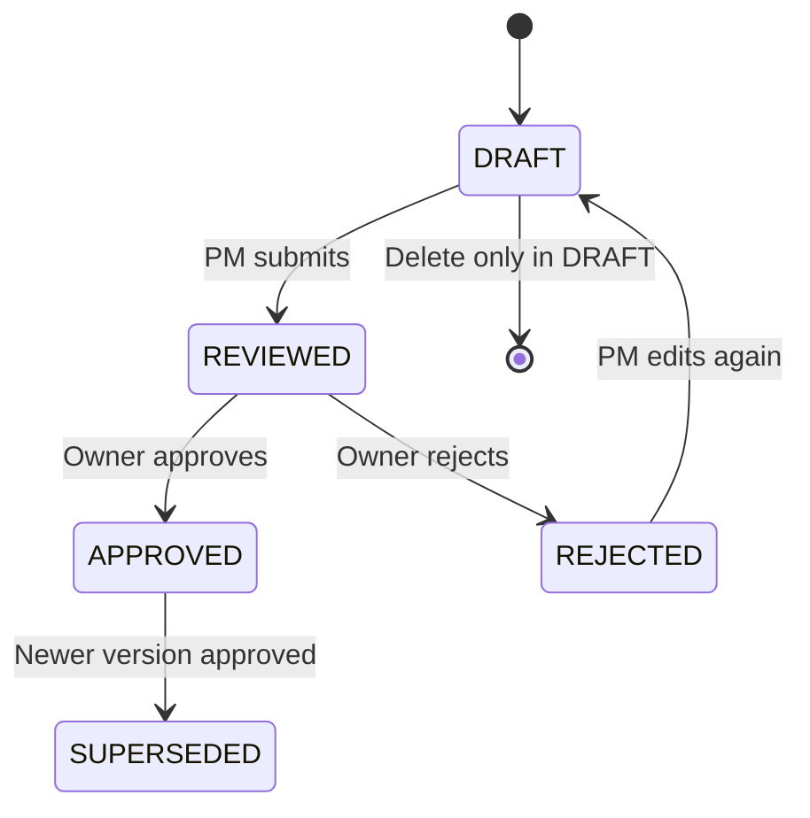

# How BuildFlow Estimates Work

**For project managers, owners, and anyone preparing or approving project costs**

This guide explains how estimates are structured, calculated, reviewed, and turned into executable BOQ (Bill of Quantities) in BuildFlow.

See also: [Business Guide](./BUSINESS_GUIDE.md) for roles, onboarding, and overall workflows.

---

## What an estimate is

An **estimate** is a **project cost plan** - a structured breakdown of what a construction job will cost before and during execution. Each estimate belongs to **one project** and **one company**.

| Layer | Meaning | Example |
|-------|---------|---------|
| **Estimate** | Named version with status, margins, totals | "Rev 2 - Office Renovation" v3 |
| **Section** | Group of related work | Substructure, Finishing, MEP |
| **Line item** | One measurable cost line | "RCC M25 in footings", 32 cum @ ₹7,800 |

Each line item has: description, unit, quantity, rate, **amount** (= quantity × rate), and a **cost type**:

- **MATERIAL**
- **LABOUR**
- **EQUIPMENT**
- **SUBCONTRACTOR**
- **MISC**

Items can optionally link to a **Resource** from **Settings → Material Prices** so GST rates apply correctly on the summary.

---

## Where to work with estimates

| Entry point | Who | What |
|-------------|-----|------|
| **Projects → [project] → Estimate tab** | Owner, PM | List versions, create, compare, open detail |
| **Estimation** (main menu) | Owner, PM | Rate Analysis library, shortcuts to projects |
| **Settings → Rate Analysis Library** | Owner, PM | Reusable composite rate templates |
| **Settings → Material Prices** | Users with access | Resource rates used on line items |

**Important:** Estimates always live **inside a project**. The Estimation hub does not store standalone estimates - it helps you manage rate libraries and navigate to projects.

---

## Creating an estimate (3-step wizard)

When you tap **Create estimate** from a project, BuildFlow walks you through three steps:

### Step 1 - Setup

- Estimate **name** and **notes**
- **Overhead %**, **Contingency %**, **Profit margin %** (typical defaults: 8%, 5%, 10%)
- Saves a **DRAFT** estimate with the next **version number** for that project (v1, v2, v3…)

### Step 2 - Build sections and items

You can:

1. **Add sections manually** (e.g. Civil, Electrical, MEP)
2. **Load a pre-made template** - e.g. "Residential G+2" or "Office Renovation" - then change quantities, rates, add or remove lines
3. **Add line items** to each section (quantity, rate, unit, cost type)
4. Optionally link lines to **Material Prices** or **Rate Analysis** for consistent rates and GST

### Step 3 - Review

- Review the **cost breakdown** (material, labour, equipment, etc.) and **grand total**
- Submit for owner review when ready

---

## How totals are calculated

BuildFlow recalculates totals whenever you open an estimate, so you always see current figures.

| Step | Formula |
|------|---------|
| Line amount | quantity × rate (each line) |
| Subtotal | Sum of all line amounts |
| Overhead | subtotal × overhead % |
| Contingency | subtotal × contingency % |
| Profit | subtotal × profit margin % |
| Before GST | subtotal + overhead + contingency + profit |
| GST | Applied per linked resource GST rate (weighted) |
| **Grand total** | before GST + GST |

The detail screen also shows **cost mix** - what percentage of the total is material, labour, equipment, and so on.

When an estimate is **submitted** or **approved**, these totals are saved on the record for reporting and BOQ conversion.

---

## Approval workflow

Estimates follow a formal review path so the company head signs off before costs become the project baseline.

| Status | Can edit? | Who acts |
|--------|-----------|----------|
| **DRAFT** | Yes (PM / Owner) | Build lines, then submit |
| **REVIEWED** | No | Owner approves or rejects |
| **REJECTED** | Yes again | PM fixes issues and re-submits |
| **APPROVED** | Locked | Owner may convert to BOQ |
| **SUPERSEDED** | Read-only | Older approved version replaced by a newer one |

### Rules to remember

- Only **DRAFT** estimates can be **deleted**
- Only **DRAFT** or **REJECTED** estimates can be **edited** - for other statuses, use **Duplicate** to create a new version
- Submit requires **at least one line item**
- **Only the Owner** can approve or reject
- When a new estimate is approved, any **previous APPROVED** version on the same project becomes **SUPERSEDED**

---

## Versions and comparison

- Every new estimate on a project gets an automatic **version number** (1, 2, 3…)
- **Duplicate** copies all sections and items into a new **DRAFT** with the next version - use this for revisions without touching locked approved copies
- **Compare** two versions side by side - section subtotals and grand total difference with percentage change (from the project Estimate tab or Estimation → Compare)

Use comparison when scope, rates, or quantities change between tender revisions.

---

## Convert to BOQ (after approval)

Once an estimate is **APPROVED**, the **Owner** can **Convert to BOQ**. This connects the cost plan to execution:

1. **Archives** the project’s existing BOQ lines (they are marked superseded, not deleted)
2. **Creates one BOQ line** for each estimate line (quantity, rate, description, category)
3. **Updates the project budget** to the estimate grand total
4. **Links** BOQ lines back to the estimate for traceability

After conversion, the team tracks execution on the project **BOQ tab**. The approved estimate remains the formal cost baseline; BOQ is the working quantity schedule.

---

## Rate Analysis vs estimate templates

| | Estimate templates | Rate Analysis library |
|--|---------------------|------------------------|
| **What** | Pre-filled sections and lines (e.g. G+2 building) | Composite rates built from material + labour + equipment components |
| **Where stored** | Built into the app as starters | Your company database |
| **Who maintains** | BuildFlow product | Your PM / estimator |
| **Best for** | Fast first draft on common project types | Standard items reused across many estimates |

**Material Prices** (Settings) holds individual resources (cement, steel, labour day-rates) with GST - line items can reference these for live pricing.

---

## Exports and what happens next

| Feature | Use |
|---------|-----|
| **Excel export** | Share with client, internal review, or Excel workflows |
| **PDF export** | Formal tender / submission document |
| **Estimate vs actual** | Project overview and reports compare approved estimate to money spent |
| **BuildFlow Assistant** | Ask about estimate vs actual variance in plain language |
| **Data export** | Owner backup includes all estimate versions (Settings → Data Export) |

---

## Who can do what

| Role | Create / edit DRAFT | Submit | Approve / reject | Convert to BOQ | View |
|------|---------------------|--------|------------------|----------------|------|
| **Owner** | Yes | Yes | Yes | Yes | Yes |
| **PM** | Yes | Yes | No | No | Yes |
| **Supervisor** | No | No | No | No | Limited (project context) |
| **Accountant** | No | No | No | No | Reports / financial views |

---

## Typical workflow (step by step)

1. **PM** opens a project → **Estimate tab** → **Create estimate**
2. Loads a **template** or builds sections using **Material Prices** and **Rate Analysis**
3. Sets overhead, contingency, and profit → checks **grand total**
4. **Submits for review** → status becomes **REVIEWED**
5. **Owner** reviews the breakdown → **Approves** or **Rejects** (with reason)
6. If approved → **Owner converts to BOQ** → project budget updates → team executes against BOQ
7. If scope or prices change later → **Duplicate** to create the next version → compare old vs new

---

## Quick troubleshooting

| Situation | What to do |
|-----------|--------------|
| Can't edit estimate | Check status - only DRAFT or REJECTED are editable; duplicate if APPROVED |
| Can't convert to BOQ | Estimate must be **APPROVED**; only **Owner** can convert |
| Can't submit | Add at least one line item |
| Grand total looks wrong | Check overhead/contingency/profit % on setup; verify line qty × rate |
| Old approved version disappeared from "active" | It may be **SUPERSEDED** - still visible in version list, read-only |

---

## Technical reference (for IT / developers)

| Area | Location in codebase |
|------|----------------------|
| Estimate business logic | `apps/backend/src/services/estimate.service.ts` |
| BOQ conversion | `apps/backend/src/services/boq.service.ts` |
| API routes | `apps/backend/src/routes/estimate.routes.ts` |
| Create wizard UI | `apps/mobile/app/(app)/estimation/create.tsx` |
| Detail / approve UI | `apps/mobile/app/(app)/estimation/[id].tsx` |
| Client templates | `apps/mobile/constants/estimate-templates.ts` |
| Frontend API hooks | `apps/mobile/services/estimate.queries.ts` |
| Data model | `apps/backend/prisma/schema.prisma` (Estimate, EstimateSection, EstimateItem) |

---

*Last updated: June 2026*
