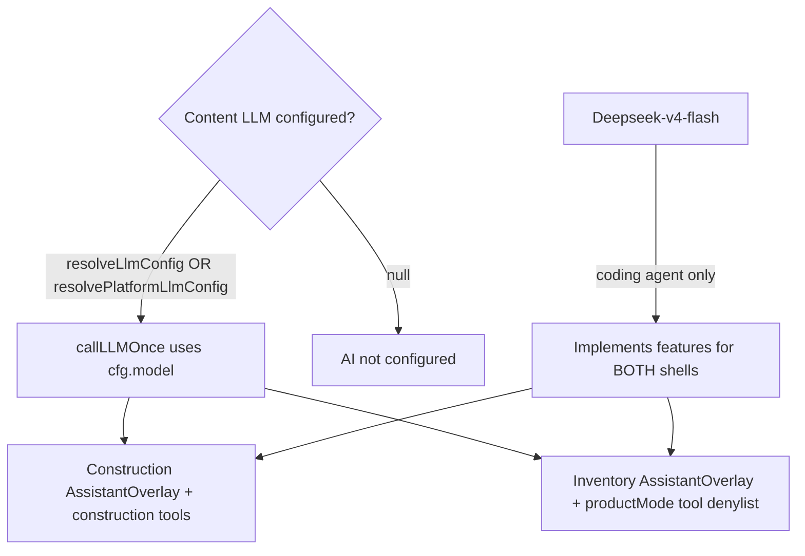

# BuildFlow - Inventory UX Polish - Implementation Plan (Deepseek-Flash-V4)

> **Audience:** Deepseek-Flash-V4 (coding agent)  
> **Repo:** `/home/prasanna/work/BuildFlow`  
> **Products in scope for AI (D10):** **both** Construction ERP **and** Inventory - same assistant stack, product-scoped prompts/tools.  
> **Pricing:** Inventory **₹499/mo** / **₹4,990/yr** - do not regress.  
> **Construction safety:** Indent auto-approve **only** when `subscriptionPlan === 'INVENTORY'`. Construction `ProcurementTab` keeps Draft → Submit → Approve.  

---

## 0. Locked decisions

| # | Decision |
|---|----------|
| D1 | Responsive phone / tablet / desktop via `useViewport` |
| D2 | Inventory indent create → **APPROVED**; construction DRAFT flow unchanged |
| D3 | Indent **Create PO** → orders tab + modal prefill |
| D4 | PO **Record GRN** → GRNs tab + modal prefill |
| D5 | No duplicate primary create CTAs on inventory procurement |
| D6 | Optional invoice `clientAddress` / `clientPhone` |
| D7 | Materials edit rate + delete |
| D8 | PO/GRN numbers auto-suggested (`PO/GRN-YYYY-NNNN`); user may edit before save |
| D9 | Multi-material procure + retrieve (Indent / PO / GRN / Issue with multiple lines) |
| **D10** | **LLM routing (Construction + Inventory):** when a tenant/platform has a configured content LLM (or uploaded knowledge), **that** LLM owns chatbot + upload-related AI for **both** product modes - not a hard-coded Deepseek product model. Deepseek-v4-flash = coding agent only. |

---

## 1. Verification status (re-verified 2026-08-11)

### 1.1 D1–D10 - CODE + DOC COMPLETE

| Item | Evidence | Construction impact |
|------|----------|---------------------|
| D2 | `autoApprove = subscriptionPlan === 'INVENTORY'` only | **Safe** |
| D9 | Multi indent/PO/GRN/issue | Inventory UI + Inventory-gated invoice |
| D2 regression | `procurement.test.ts` multi-line create → `status === 'DRAFT'` | Locked |
| No construction draft invoice on issue | `construction manual stock issue does NOT create a draft sales invoice` → `draftInvoiceId` null | Locked |
| D10 | §6.1–§6.8 + comment on `callLLMOnce` | Shared chatbot; content LLM for both products |
| Tests | `inventory-product` + `procurement.test` → **32/32 PASS** | Green |

**`ProcurementTab.tsx`:** D8 number prefill only. Draft → Submit → Approve **intact**.

### 1.2 Construction ERP - verified safe

| Risk | Status |
|------|--------|
| Auto-APPROVE leak | **No** - plan gate + DRAFT assertion in tests |
| Issue creates sales invoice | **No** - inventory-only draft invoice + construction issue test |
| Chatbot / LLM | **Content LLM via `resolveLlmConfig`** for Construction + Inventory; Deepseek = coding agent |

### 1.3 Remaining gaps (THIS Deepseek pass - smoke / ops only)

Do **not** reimplement D1–D10. Only:

1. **Manual smoke** (if app + API running):
   - Inventory `owner@hydmaterials.com` / `Test@1234`: 2-material Indent → PO → GRN → Issue materials (2 lines) → one draft invoice; assistant opens from `/inventory`.
   - Construction `owner@reddyconst.com` / `Test@1234`: multi-line indent stays **Draft** until Submit → Approve; assistant opens from dashboard; no unexpected draft sales invoice on stock issue.
2. **Ops notes** in §3 if migrate / login payload already done in your env.
3. Fix **only** concrete smoke bugs (prefer inventory UI; never touch auto-approve gating or Draft→Submit→Approve).
4. Update §3 smoke/ops checkboxes when done.

### 1.4 Non-issues

- Multi-issue `stockMovementId` = first movement - intentional.  
- Duplicate PO 409 console noise in tests - expected.  
- §6 line numbers may drift; prefer symbol names (`callLLMOnce`, `resolveLlmConfig`) over fragile Lxx cites.

---

## 2. What Deepseek should do THIS pass

**Goal:** Optional manual smoke + ops checklist. **Do not** reimplement D1–D10 or expand RAG.

1. Re-read §1.3 and §3.  
2. If the environment is up, run smoke in §1.3.1; fix only real bugs.  
3. If no app environment: leave smoke unchecked and note “code complete; smoke deferred”.  
4. Re-run tests after any code fix:

```bash
cd /home/prasanna/work/BuildFlow/packages/shared && npm run build
cd /home/prasanna/work/BuildFlow/apps/backend && npm test -- --testPathPattern='inventory-product|procurement.test' --forceExit
```

5. Flip §3 checkboxes for what you completed.

**Do not:**

- Change auto-approve gating  
- Rewrite Draft→Submit→Approve  
- Hard-code Deepseek as product chat model  
- Build RAG / embedding / upload AI product this pass  
- Re-open pricing / reimplement D9  

---

## 3. Checklist

### Implementation - done

- [x] D1–D9  
- [x] Construction multi-line indent → **DRAFT** regression  
- [x] Construction stock issue → `draftInvoiceId` null  
- [x] **D10** §6 feasibility (Construction + Inventory) + `callLLMOnce` comment  
- [x] Tests **32/32** green (`inventory-product` + `procurement.test`)  

### THIS pass (smoke / ops)

- [ ] Manual smoke inventory multi procure + multi issue + assistant overlay  
- [ ] Manual smoke construction Draft → Submit → Approve + assistant overlay  
- [ ] Prod migrate `20260811140000_invoice_client_contact` if needed  
- [ ] Confirm login returns `productMode` / `subscriptionPlan` / `defaultProjectId`  

---

## 4. Credentials

- Inventory: `owner@hydmaterials.com` / `Test@1234` → `/inventory`  
- Construction: `owner@reddyconst.com` / `Test@1234` → project Procurement / dashboard  

---

## 5. Non-goals

- Do not remove auto draft bills/invoices on GRN/Issue  
- Do not auto-approve non-INVENTORY indents  
- Do not redesign construction procurement  
- Do not change Inventory price from ₹499/mo  
- Do not reimplement D9 / D10 if already green  
- Do not replace tenant/platform BYOK LLM with Deepseek for chatbot (Construction **or** Inventory)  
- Do not fork an Inventory-only or Construction-only assistant  

---

## 6. Deepseek-v4-flash feasibility vs existing content LLM (D10) - DONE

### 6.1 What exists today (repo fact)

| Piece | Path / mechanism |
|-------|------------------|
| In-app assistant | `chatbot.service.ts` - OpenAI-compatible `/chat/completions` |
| Tool calling | `assistant-tools.service.ts` + `buildPermissionAwarePrompt` |
| Config | `resolveLlmConfig(companyId)` → company Settings LLM, else platform `LLM_API_URL` / `LLM_API_KEY` / `LLM_MODEL` via `resolvePlatformLlmConfig()` |
| Construction shell | `apps/mobile/app/(app)/_layout.tsx` → `AssistantOverlay` |
| Inventory shell | `apps/mobile/app/inventory/_layout.tsx` → same `AssistantOverlay` |
| Marketing | `MarketingAssistantFab` → public chatbot; platform LLM; no tenant data |
| Settings | `llmIntegrationSchema` - any OpenAI-compatible host |

**Wiring:** `callLLMOnce` uses `resolveLlmConfig(companyId)` when logged-in, else `resolvePlatformLlmConfig()`, then `POST {cfg.apiUrl}/chat/completions` with `model: cfg.model`. Tools: `buildOpenAiTools(identity.permissions, identity.productMode)` so Inventory cannot call construction-only tools on the shared service.

### 6.2 Roles for Deepseek-v4-flash

| Role | Recommendation |
|------|----------------|
| Coding agent | **Primary** - implement features for both products |
| Default in-app chat model | **Do not force** if content LLM configured |
| Upload / doc AI answers | Always **content LLM** (`resolveLlmConfig`) when configured |
| RAG / embeddings | Out of scope until a dedicated design |

### 6.3 Locked routing rule (D10)

```
IF resolveLlmConfig / resolvePlatformLlmConfig succeeds
  → chatbot + upload-related AI MUST use that configured LLM
ELSE
  → graceful “AI not configured”
NEVER hard-code Deepseek-v4-flash as the product chat model
Deepseek-v4-flash = coding agent for BuildFlow implementation
```

Applies to **Construction ERP and Inventory** equally.

### 6.4 Feasibility notes

OpenAI-compatible API already; tool calling must be verified before ops points platform `LLM_*` at any Deepseek-hosted chat. Per-company settings for privacy. Upload AI must not introduce a second provider.

### 6.5 Dual-product matrix

| Product | UI | Backend | Upload AI examples (future) |
|---------|-----|---------|------------------------------|
| Construction | `(app)/_layout` → Overlay | Same `chatbot.service` | BOQ PDF, daily-report photos, vendor bill PDF |
| Inventory | `inventory/_layout` → Overlay | Same | GRN/PO scans, invoice images, catalog |
| Marketing | Marketing FAB | Public route | N/A (no tenant content) |

### 6.6 Decision tree



### 6.7 Future upload AI checklist (when built later)

1. Reuse `callLLMOnce` / `resolveLlmConfig` for both products.  
2. Respect `productMode` + `buildOpenAiTools(...)`.  
3. One assistant service - no product fork.  
4. No RAG DB / embedding service / silent `.env` model swap without ops consent in polish pass.

---

## 7. Reference files

```
apps/backend/src/services/chatbot.service.ts
apps/backend/src/services/assistant-tools.service.ts
apps/backend/src/services/integration.service.ts
apps/backend/src/routes/chatbot.routes.ts
packages/shared/src/permissions/prompt-builder.ts
packages/shared/src/validators/settings.ts
apps/mobile/components/assistant/*
apps/mobile/app/(app)/_layout.tsx
apps/mobile/app/inventory/_layout.tsx
apps/mobile/app/(app)/settings/integrations.tsx
apps/mobile/components/marketing/MarketingAssistantFab.tsx
```
