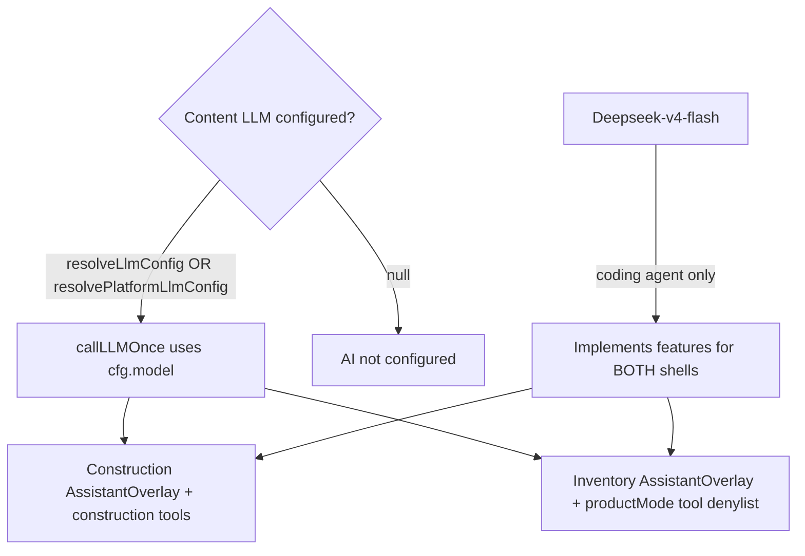

# BuildFlow - Inventory UX Polish - Implementation Plan (Deepseek-Flash-V4)

> **Audience:** Deepseek-Flash-V4 (coding agent)  
> **Repo:** `/home/prasanna/work/BuildFlow`  
> **Products in scope for AI (D10 + D11):** **both** Construction ERP **and** Inventory - same assistant stack, product-scoped prompts/tools.  
> **Current AI pass:** **D11 is code-complete.** Operator device smoke of formatted assistant replies remaining. Do not reimplement D10 routing.  
> **Pricing:** Inventory **₹499/mo** / **₹4,990/yr** - do not regress.  
> **Construction safety:** Indent auto-approve **only** when `subscriptionPlan === 'INVENTORY'`. Construction `ProcurementTab` keeps Draft → Submit → Approve.  

---

## 0. Locked decisions

| # | Decision |
|---|----------|
| D1 | Responsive phone / tablet / desktop via `useViewport` |
| D2 | Inventory indent create → **APPROVED**; construction DRAFT flow unchanged |
| D3 | Indent **Create PO** → orders tab + modal prefill |
| D4 | PO **Record GRN** → GRNs tab + modal prefill |
| D5 | No duplicate primary create CTAs on inventory procurement |
| D6 | Optional invoice `clientAddress` / `clientPhone` |
| D7 | Materials edit rate + delete |
| D8 | PO/GRN numbers auto-suggested (`PO/GRN-YYYY-NNNN`); user may edit before save |
| D9 | Multi-material procure + retrieve (Indent / PO / GRN / Issue with multiple lines) |
| **D10** | **LLM routing (Construction + Inventory):** when a tenant/platform has a configured content LLM (or uploaded knowledge), **that** LLM owns chatbot + upload-related AI for **both** product modes - not a hard-coded Deepseek product model. Deepseek-v4-flash = coding agent only. |
| **D11** | **Chat replies (entire system):** the assistant answers the user’s question only. No trailing “you can also ask…”, suggested follow-ups, or extra action pitches. Format with short markdown (heading, bullets, numbered steps, compact tables for figures). Chat UI must render that markdown. Empty-state starter chips before the first message may stay. Same rules for Construction, Inventory, and the marketing product guide. D10 routing is unchanged. |

---

## 1. Verification status (re-verified 2026-08-11)

### 1.1 D1–D10 - CODE + DOC COMPLETE

| Item | Evidence | Construction impact |
|------|----------|---------------------|
| D2 | `autoApprove = subscriptionPlan === 'INVENTORY'` only | **Safe** |
| D9 | Multi indent/PO/GRN/issue | Inventory UI + Inventory-gated invoice |
| D2 regression | `procurement.test.ts` multi-line create → `status === 'DRAFT'` | Locked |
| No construction draft invoice on issue | `construction manual stock issue does NOT create a draft sales invoice` → `draftInvoiceId` null | Locked |
| D10 | §6.1–§6.8 + comment on `callLLMOnce` | Shared chatbot; content LLM for both products |
| Tests | `inventory-product` + `procurement.test` → **32/32 PASS** | Green |

**`ProcurementTab.tsx`:** D8 number prefill only. Draft → Submit → Approve **intact**.

### 1.2 Construction ERP - verified safe

| Risk | Status |
|------|--------|
| Auto-APPROVE leak | **No** - plan gate + DRAFT assertion in tests |
| Issue creates sales invoice | **No** - inventory-only draft invoice + construction issue test |
| Chatbot / LLM | **Content LLM via `resolveLlmConfig`** for Construction + Inventory; Deepseek = coding agent |

### 1.3 Remaining gaps (THIS Deepseek pass - smoke / ops only)

Do **not** reimplement D1–D10. Only:

1. **Manual smoke** (if app + API running):
   - Inventory `owner@hydmaterials.com` / `Test@1234`: 2-material Indent → PO → GRN → Issue materials (2 lines) → one draft invoice; assistant opens from `/inventory`.
   - Construction `owner@reddyconst.com` / `Test@1234`: multi-line indent stays **Draft** until Submit → Approve; assistant opens from dashboard; no unexpected draft sales invoice on stock issue.
2. **Ops notes** in §3 if migrate / login payload already done in your env.
3. Fix **only** concrete smoke bugs (prefer inventory UI; never touch auto-approve gating or Draft→Submit→Approve).
4. Update §3 smoke/ops checkboxes when done.

### 1.4 Non-issues

- Multi-issue `stockMovementId` = first movement - intentional.  
- Duplicate PO 409 console noise in tests - expected.  
- §6 line numbers may drift; prefer symbol names (`callLLMOnce`, `resolveLlmConfig`) over fragile Lxx cites.

---

## 2. What Deepseek should do THIS pass

**Status (2026-08-23): M1–M7 code-complete (audited).** M7/11.8 implemented; remaining work is **operator device smoke** - Inventory phone shell polish + Kirana **phone Checkout item picker** (desktop checkout already OK). Spec: §3 M7. Do **not** reimplement M1–M7 / D10 / D11 unless a smoke bug is found.

**Do not:**

- Change Construction auto-approve / Draft→Submit→Approve  
- Hard-code Deepseek as product chat model  
- Change Inventory ₹499 pricing  
- Remove desktop Kirana checkout tables  
- Re-open D9 / D10 / D11 / Phases 0–10  

---

## 3. Checklist

### Implementation - done

- [x] D1–D9  
- [x] Construction multi-line indent → **DRAFT** regression  
- [x] Construction stock issue → `draftInvoiceId` null  
- [x] **D10** §6 feasibility (Construction + Inventory) + `callLLMOnce` comment  
- [x] Tests **32/32** green (`inventory-product` + `procurement.test`)  

### D11 - Assistant answer format (THIS coding pass, with Kirana 11.7)

- [x] `buildPermissionAwarePrompt` CORE RULES: answer only; no trailing suggestions / “would you like” / extra questions after the answer; use markdown (heading + bullets/tables)
- [x] `buildProductMarketingPrompt` same answer-only + markdown rule
- [x] `AssistantChatContent` renders bot markdown (bold, headings, lists, simple tables) instead of a single raw `Text`; user bubbles stay plain
- [x] Empty-state chips remain until first send; no post-reply suggestion chips
- [x] Construction + Inventory overlays share this UI; D10 `resolveLlmConfig` unchanged; do not hard-code Deepseek as chat model
- [x] Shared build + existing chatbot/prompt tests if present; no Construction Draft→Submit→Approve changes

**Evidence (2026-08-19):** `packages/shared` build clean; `apps/backend` tsc clean; full backend jest green (inventory-product 69/69 incl. Phase 11.7, procurement.test + inventory-labels); mobile `tsc --noEmit` clean. `prompt-builder.ts` rules 9/10 + marketing `## ANSWER ONLY`/`## FORMAT`; `AssistantChatContent.tsx` `MarkdownBlocks` renderer (headings `#`–`###`, `**bold**`, `` `code` ``, `-`/`*` lists, numbered lists, GFM `|` tables). D10 routing untouched (no `resolveLlmConfig` change, no model hard-coding).

### THIS pass (smoke / ops)

- [ ] Manual smoke inventory multi procure + multi issue + assistant overlay  
- [ ] Manual smoke construction Draft → Submit → Approve + assistant overlay  
- [ ] Prod migrate `20260811140000_invoice_client_contact` if needed  
- [ ] Confirm login returns `productMode` / `subscriptionPlan` / `defaultProjectId`  

### Mobile / PWA polish (operator-reported 2026-08-20) - CODE COMPLETE

Operator bugs on Inventory **mobile browsers / iPad / phone** (Kirana or materials demo). Fixed in code; optional live-device smoke remains.

| # | Bug | Root cause (repo) | Target fix |
|---|-----|-------------------|------------|
| **M1** | **Scan** does not open camera on iPad / phone **browser** | `BarcodeScannerOverlay.tsx` sets `isNative = Platform.OS !== 'web'` and shows “Camera scanner is mobile-only” on all web builds - including mobile Safari/Chrome. Native `expo-camera` path is fine for Expo Go / native builds only. | On web **phone/tablet** (`useViewport` + UA / coarse pointer): open camera via `getUserMedia` + `BarcodeDetector` where available, else `@zxing/browser` (or equivalent) continuous decode. Keep keyboard/paste + Find. Desktop web may keep keyboard-only. Same overlay used from Stock (`inventory/index.tsx`) and checkout (`CheckoutCart.tsx`). Request `navigator.mediaDevices.getUserMedia({ video: { facingMode: 'environment' } })`. HTTPS / secure context required. |
| **M2** | Inventory **bottom tab bar** sits high with empty gap above the screen bottom | Double chrome padding: `useAppViewportLock` already sets `--app-height` to **visualViewport.height** (chrome excluded), but `InventoryMobileTabBar` still adds `tabBarPaddingBottom(..., chromeBottom)` with a **56px web floor** (`fab-layout.ts`). That pads *inside* an already-shrunk viewport. | When app height is locked to visual viewport, tab bar bottom padding should use **safe-area / env(safe-area-inset-bottom) only** (small floor on native), **not** re-add `chromeBottom` / 56px. Align `AppTabBar` the same way if it shows the same gap. Verify on iOS Safari + Android Chrome. |
| **M3** | Top bar **company / profile name cut off mid-string** on mobile | `inventory/_layout.tsx` top bar: left title `BuildFlow · Inventory` is `shrink-0`; right chip is `max-w-[220px]` but competes with bell + title on narrow widths → name truncates badly / looks chopped. Stock page also prints `user.companyName` under the title without a resilient ellipsis layout. | Mobile header: allow title to shrink (`min-w-0`), shorter mobile title (“Inventory”), put company name in a `flex-1 min-w-0` row with `numberOfLines={1}` + ellipsis; show user initial avatar if space is tight (mirror `AppMobileHeader`). Do not clip mid-glyph without ellipsis. |
| **M4** | Stock page **search works poorly** | Client filter only matches `name` + `unit` (`inventory/index.tsx` `filteredSummary`). `getStockSummary` / `StockSummaryRow` omit `sku`, `itemCode`, `barcode`. Search `Input` lives in FlatList `ListHeaderComponent` (focus / re-render jank on mobile). | (1) Include `sku`, `itemCode`, `barcode` on stock summary API + shared types. (2) Filter on name, sku, itemCode, barcode, unit (case-insensitive). (3) Move search field **above** the list (sticky / outside `ListHeaderComponent`) so typing does not remount the input. Optional: debounce 150–200ms. Empty state: “No items match …”. |

**Acceptance (Inventory `owner@hydmaterials.com` / `Test@1234` or Kirana demo):**

1. Phone/iPad **Safari or Chrome** on HTTPS: Stock → **Scan** → camera preview → scan EAN/Code128 → item found (or clear miss toast). Keyboard Find still works.  
2. Bottom nav sits flush to the visible bottom (home indicator / browser bar) with **no large empty strip** under the tabs.  
3. Top bar shows full company name with ellipsis if needed; never mid-word cut without `…`.  
4. Typing a SKU / barcode / partial name filters the stock list immediately and reliably; focus does not jump.

**Do not:** change Construction indent gating; change Inventory ₹499 pricing; hard-code Deepseek as chat model; disable keyboard barcode Find.

**Primary files:**

```
apps/mobile/components/inventory/BarcodeScannerOverlay.tsx
apps/mobile/app/inventory/index.tsx
apps/mobile/app/inventory/_layout.tsx
apps/mobile/components/navigation/InventoryTabBar.tsx
apps/mobile/components/navigation/AppTabBar.tsx
apps/mobile/components/layout/fab-layout.ts
apps/mobile/hooks/useAppViewportLock.ts
apps/mobile/hooks/useVisualViewportFrame.ts
apps/backend/src/services/procurement.service.ts   # getStockSummary select + StockSummaryRow
apps/mobile/services/expansion.queries.ts         # StockSummaryRow type
```

**Verify:** `pnpm --filter @buildflow/mobile typecheck`; backend tests touching stock summary if API shape changes; manual mobile-browser smoke for M1–M4.

**M1–M4 status:**

- [x] M1 web mobile camera Scan  
- [x] M2 tab bar gap removed  
- [x] M3 header name ellipsis / layout  
- [x] M4 stock search fields + sticky input  

**Evidence (2026-08-20, code-complete; re-verified):** mobile `tsc --noEmit` clean; backend `tsc` clean; `procurement.test` **22/22** + `inventory-product` **69/69** green. `@zxing/browser` in `apps/mobile/package.json`. i18n key `inventory.shell.titleMobile` added for M3 phone header. Live phone/iPad Scan smoke still optional.
- **M1** `BarcodeScannerOverlay.tsx`: web phone/tablet now calls `navigator.mediaDevices.getUserMedia({ video: { facingMode: 'environment' } })`; decodes via native `BarcodeDetector` when present, else `@zxing/browser` (added dep `@zxing/browser ^0.2.1`). Secure-context check + clear permission/unsupported/denied messages; rear-camera flip supported; desktop web keeps the keyboard/paste note; native `expo-camera` path unchanged.
- **M2** `fab-layout.ts tabBarPaddingBottom`: no longer re-adds `chromeBottom`/56px web floor when the app is pinned to the visual viewport - safe-area inset only (`max(safeBottom, 8)`); `InventoryMobileTabBar` + `AppTabBar` both use the shared helper.
- **M3** `inventory/_layout.tsx`: phone title shortens to “Inventory”; title + company chip are `min-w-0`/`shrink` with `numberOfLines={1}` ellipsis; Stock page subtitle ellipsizes.
- **M4** `getStockSummary` select + `StockSummaryRow` + mobile type expose `sku`/`itemCode`/`barcode`; stock search filters name/unit/sku/itemCode/barcode case-insensitively with a 150 ms debounce; search input moved above the FlatList (no remount jank); empty state “No items match …”.

### M5 - Stock home mobile viewport (2026-08-20)

Operator: on phone Inventory Stock, fixed top chrome (~title + filters + KPIs) ate ~70% of the screen; only ~30% scrolled.

- [x] Phone sticky chrome compacted to title + Checkout/Scan + search (+ ghost Materials/Import links)
- [x] Warehouse / barcode filters moved into FlatList header (scroll away)
- [x] Totals + executive/Kirana KPI cards are horizontal strips on phone (no 2×N stacked card grid)
- [x] Stack `contentStyle: { flex: 1, minHeight: 0 }` so the list fills remaining viewport
- [x] List bottom padding uses `mobileListBottomPadding` so rows clear the tab bar

### M6 - Stock search UX (2026-08-20)

Operator: typing in stock search was covered by the bottom tab bar; Scan/Find were not inline with search; typed characters could appear reversed (RN-web LTR); Find button was redundant with live filter.

- [x] Sticky row is **search + Scan** inline (Find removed) on phone and desktop
- [x] Live filter as you type (150ms debounce) - name / SKU / itemCode / barcode / unit; results sorted A–Z by name
- [x] Bottom tab bar hides while keyboard / text field is focused (`useKeyboardOpen`)
- [x] Search `Input` uses LTR `writingDirection` + `autoCorrect={false}` + `compact` (no remount / reverse-type quirks)
- [x] Separate barcode + Find row removed; Scan fills search and runs barcode API lookup → item detail
- [x] Warehouse filter remains in list header (phone) / above search (desktop)

### M7 - Inventory mobile UX + Kirana phone checkout item picker (DONE - 2026-08-23)

**Operator / product ask:** Inventory on **phone** still feels weaker than the marketed product (counter-speed stock, scan, multi-warehouse trading). Desktop Kirana **Checkout** catalog is usable (full table: Item · Unit · On hand · MRP · Selling · Status · Add). On **phone**, picking *more* items after checkout opens is **not** counter-friendly: catalog is a thin `max-h-[38%]` name-only strip, cart cards are tall (labeled `Input`s), nested scrolls fight each other, and adding a second/third SKU is slow.

**Marketing inspiration (do not invent new product claims - match shipped positioning in `apps/mobile/constants/marketing.ts` + `docs/INVENTORY_TYPES_GUIDE.md`):**

| Marketed promise | Mobile UX implication for M7 |
|------------------|------------------------------|
| “Stock product for retail / wholesale / trading / materials / equipment” | Phone Stock home stays **scan + search + list-first**; chrome stays thin (M5/M6). |
| Counter / walk-in **Issue** and Kirana **Checkout** | Phone checkout must feel like a **POS**: browse/add fast, then edit cart - not a cramped half-sheet. |
| Multi-warehouse, SO→challan, parties, Tally | Do **not** redesign those modules this pass; only polish phone patterns that already exist (cards, sticky CTAs). |
| Inventory from ₹499/mo | **Do not change pricing** (locked ₹499/mo in plans). |
| Profiles change **labels**, not engines | Keep `getInventoryLabel` / vertical gates; Kirana-only checkout improvements stay behind `pos_checkout` + `KIRANA`. |

**Root cause (repo):** `apps/mobile/components/inventory/CheckoutCart.tsx` phone branch (~L440–472):

1. Catalog capped `max-h-[38%]` with bare `name | balance` rows (no MRP / sell / Add / low-stock).
2. Nested `ScrollView` (catalog) + `ScrollView` (cart) + sticky Charge - hard to browse while cart grows.
3. Cart uses full `Input` with labels (qty + selling) → each line ~3× desktop `CellInput` height.
4. After first add, catalog shrinks in attention; “selection of different items” feels broken vs desktop split pane.

**Also polish (phone Inventory shell - light touch, same pass):**

| Area | Problem | Target |
|------|---------|--------|
| Stock list rows | Dense / weak tap targets after M5 | Clear primary line (name), secondary (SKU · unit · on hand · sell), one obvious Issue/Checkout affordance |
| Tab / secondary screens | Parties, Materials, Sales, Warehouse on phone | Keep **cards**; ensure list search is sticky; primary FAB/header CTA not duplicated with empty-state button (same rule as Construction Reports) |
| Modals on phone | Some still feel “desktop squeezed” | Prefer bottom-sheet / near-fullscreen for multi-line ops; single-field forms stay compact |

#### M7.1 Kirana phone checkout - item selection (primary)

Implement in `CheckoutCart.tsx` when `isPhone` (desktop/tablet **unchanged** - keep the two-pane tables).

**Interaction model (phone POS):**

1. **Two modes** with a segmented control under the header: **Browse** | **Cart (N)**  
   - Default **Browse** when cart empty; auto-switch to **Cart** after first add is OK **or** stay on Browse with a floating “Cart · N · ₹X” chip that switches mode (pick one; document in evidence).  
   - **Browse** = full remaining height for catalog (search + Scan sticky at top).  
   - **Cart** = full height for lines + optional customer + sticky **Charge & issue stock**.
2. **Catalog row (phone)** must show at least: **name**, **on hand + unit**, **selling ₹** (and MRP if set), **Low** badge when applicable, clear **Add** / tap-to-add. Tap increments qty if already in cart (existing `addItem` behavior). Optional: show small qty stepper on the row when already in cart.
3. **Do not** keep `max-h-[38%]` catalog forever competing with cart on one screen.
4. **Cart lines (phone):** compact qty ± steppers (or `CellInput`-style) + sell price field; remove tall labeled `Input` pairs. Show line ₹, GST%, remove.
5. Search filters catalog live (already); also match **sku / itemCode / barcode** like Stock M4 if those fields exist on `StockSummaryRow`.
6. Scan still adds/increments cart (11.3); after scan, toast + stay on Browse or briefly flash Cart chip count.
7. Sticky Charge footer only in **Cart** mode (or always visible mini-bar: `N items · ₹total` + Charge) - must clear home indicator / keyboard (`useKeyboardOpen` / safe area).
8. Keep FEFO / allow-expired / server allocation behavior; no lot picking in UI.

**Acceptance (Kirana phone - `owner@kirana-demo.com` / `Test@1234` or seeded Kirana vertical):**

1. Open Checkout → browse catalog **full-height** without typing; tap 5 different items quickly; each appears in cart with qty ≥1.  
2. Switch to Cart → edit qty/price → Charge works; draft invoice path unchanged.  
3. Search “biscuit” / scan barcode adds the right SKU.  
4. Desktop/tablet checkout layout **visually unchanged**.  
5. Non-Kirana Inventory still uses `MultiIssueStockModal` (or improve phone multi-issue lightly with same compact patterns - optional, do not break).

#### M7.2 Broader Inventory phone shell (secondary, same pass if time)

- Stock home: keep M5/M6 sticky search+Scan; ensure Issue/Checkout CTA not duplicated; list rows readable one-handed.  
- Empty states: one create CTA (header **or** empty action **or** FAB - not two).  
- No new tabs; no Construction changes.

#### M7 files

```
apps/mobile/components/inventory/CheckoutCart.tsx          # primary
apps/mobile/app/inventory/index.tsx                       # Stock phone row / CTA polish if needed
apps/mobile/components/inventory/StockModals.tsx           # optional phone MultiIssue compact
apps/mobile/hooks/useKeyboardOpen.ts                      # reuse if Charge/footer conflicts with keyboard
docs/INVENTORY_UX_POLISH.md                               # tick M7 + evidence
docs/INVENTORY_KIRANA_RETAIL_WHOLESALE_PLAN.md              # Phase 11.8 checklist
```

#### M7 verify

```
pnpm --filter @buildflow/mobile exec tsc --noEmit
# targeted inventory + construction regressions if any API touched (prefer UI-only)
```

**Do not:** change Construction indent gating; change Inventory ₹499 pricing; hard-code Deepseek as chat model; remove desktop checkout tables; rewrite FEFO; expand i18n beyond needed keys; reopen Phase 0–10.

**M7 status:**

- [x] M7.1 phone Browse | Cart checkout item picker  
- [x] M7.1 catalog rows show sell/MRP/stock/Add  
- [x] M7.1 compact cart lines + sticky Charge  
- [x] M7.1 search matches sku/itemCode/barcode when present  
- [x] Desktop/tablet checkout unchanged  
- [x] M7.2 light Stock/shell CTA polish (if done)  
- [x] Evidence + checkboxes updated below

**Evidence (2026-08-23, code-complete; audited):** `pnpm --filter @buildflow/mobile exec tsc --noEmit` clean. UI-only - no backend/API change (stock summary already exposes `sku`/`itemCode`/`barcode` from M4).
- **M7.1** `CheckoutCart.tsx` phone branch: segmented **Browse | Cart (N)**; Browse = full-height catalog (sticky search + Scan); Cart = full-height compact lines + collapsed customer + sticky Charge (`KeyboardAvoidingView` + safe-area). No permanent `max-h-[38%]` split (only mentioned in comments). Catalog rows: name, on hand+unit, selling ₹ (+ MRP), Low badge, round Add; tap increments ("In cart · N"); floating `N items · ₹total → View cart`. Cart lines: qty ± steppers + `CellInput` sell. Search matches name/unit/sku/itemCode/barcode. Seed from stock row opens **Cart**. Desktop/tablet two-pane tables unchanged. FEFO / allow-expired / scan path unchanged.
- **M7.2** Stock phone row secondary `On hand · Sell · SKU`; primary CTA accent Checkout/Issue; Adjust secondary. `MultiIssueStockModal` phone qty/price/batch use `CellInput`s.
- **Residual (operator smoke, not blocking code):** live phone/PWA Checkout browse→5 adds→Charge; keyboard + home-indicator clearance on Charge; confirm desktop checkout still side-by-side after deploy.  

---

## 4. Credentials

- Inventory: `owner@hydmaterials.com` / `Test@1234` → `/inventory`  
- Construction: `owner@reddyconst.com` / `Test@1234` → project Procurement / dashboard  

---

## 5. Non-goals

- Do not remove auto draft bills/invoices on GRN/Issue  
- Do not auto-approve non-INVENTORY indents  
- Do not redesign construction procurement  
- Do not change Inventory price from ₹499/mo  
- Do not reimplement D9 / D10 if already green  
- Do not replace tenant/platform BYOK LLM with Deepseek for chatbot (Construction **or** Inventory)  
- Do not fork an Inventory-only or Construction-only assistant  

---

## 6. Deepseek-v4-flash feasibility vs existing content LLM (D10) - DONE

### 6.1 What exists today (repo fact)

| Piece | Path / mechanism |
|-------|------------------|
| In-app assistant | `chatbot.service.ts` - OpenAI-compatible `/chat/completions` |
| Tool calling | `assistant-tools.service.ts` + `buildPermissionAwarePrompt` |
| Config | `resolveLlmConfig(companyId)` → company Settings LLM, else platform `LLM_API_URL` / `LLM_API_KEY` / `LLM_MODEL` via `resolvePlatformLlmConfig()` |
| Construction shell | `apps/mobile/app/(app)/_layout.tsx` → `AssistantOverlay` |
| Inventory shell | `apps/mobile/app/inventory/_layout.tsx` → same `AssistantOverlay` |
| Marketing | `MarketingAssistantFab` → public chatbot; platform LLM; no tenant data |
| Settings | `llmIntegrationSchema` - any OpenAI-compatible host |

**Wiring:** `callLLMOnce` uses `resolveLlmConfig(companyId)` when logged-in, else `resolvePlatformLlmConfig()`, then `POST {cfg.apiUrl}/chat/completions` with `model: cfg.model`. Tools: `buildOpenAiTools(identity.permissions, identity.productMode)` so Inventory cannot call construction-only tools on the shared service.

### 6.2 Roles for Deepseek-v4-flash

| Role | Recommendation |
|------|----------------|
| Coding agent | **Primary** - implement features for both products |
| Default in-app chat model | **Do not force** if content LLM configured |
| Upload / doc AI answers | Always **content LLM** (`resolveLlmConfig`) when configured |
| RAG / embeddings | Out of scope until a dedicated design |

### 6.3 Locked routing rule (D10)

```
IF resolveLlmConfig / resolvePlatformLlmConfig succeeds
  → chatbot + upload-related AI MUST use that configured LLM
ELSE
  → graceful “AI not configured”
NEVER hard-code Deepseek-v4-flash as the product chat model
Deepseek-v4-flash = coding agent for BuildFlow implementation
```

Applies to **Construction ERP and Inventory** equally.

### 6.4 Feasibility notes

OpenAI-compatible API already; tool calling must be verified before ops points platform `LLM_*` at any Deepseek-hosted chat. Per-company settings for privacy. Upload AI must not introduce a second provider.

### 6.5 Dual-product matrix

| Product | UI | Backend | Upload AI examples (future) |
|---------|-----|---------|------------------------------|
| Construction | `(app)/_layout` → Overlay | Same `chatbot.service` | BOQ PDF, daily-report photos, vendor bill PDF |
| Inventory | `inventory/_layout` → Overlay | Same | GRN/PO scans, invoice images, catalog |
| Marketing | Marketing FAB | Public route | N/A (no tenant content) |

### 6.6 Decision tree



### 6.7 Future upload AI checklist (when built later)

1. Reuse `callLLMOnce` / `resolveLlmConfig` for both products.  
2. Respect `productMode` + `buildOpenAiTools(...)`.  
3. One assistant service - no product fork.  
4. No RAG DB / embedding service / silent `.env` model swap without ops consent in polish pass.

---

## 7. Deepseek-v4-flash agent command - post-M7 (copy-paste)

> **M7 / Phase 11.8 are CODE-COMPLETE (audited 2026-08-23).** Do **not** re-implement Browse|Cart unless a concrete smoke bug is filed. Use this prompt only for smoke fixes or the next polish pass.

```
You are Deepseek-v4-flash, the coding agent for BuildFlow.

READ FIRST:
- docs/INVENTORY_UX_POLISH.md §2 + §3 M7 (DONE evidence) + §5 non-goals + §6 D10
- docs/INVENTORY_KIRANA_RETAIL_WHOLESALE_PLAN.md Phase 11.8 (DONE checklist)
- docs/INVENTORY_HORIZONTAL_PLATFORM.md §1.3 + §3

ROLE: coding agent only. Do NOT hard-code Deepseek as the in-app chat model (D10).

STATUS: M1–M7 and Kirana 11.0–11.8 are CODE-COMPLETE.
Phone Checkout already has Browse | Cart (N), rich catalog rows, compact cart
lines, sticky Charge, sku/itemCode/barcode search (CheckoutCart.tsx).

THIS PASS (pick one):
A) Operator smoke only - fix concrete bugs found on phone/PWA Kirana Checkout
   or Stock list. Prefer minimal diffs. Do not redesign.
B) If no smoke bugs: STOP. Do not invent drive-by refactors.

SMOKE CHECKLIST (Kirana phone - owner@kirana-demo.com / Test@1234 or seeded):
1) Checkout → Browse full-height without typing; tap 5 different items; each in cart
2) View cart / Cart tab → edit qty/price → Charge; draft invoice path OK
3) Search name/SKU/barcode + Scan add while in Browse
4) Desktop/tablet still two-pane catalog|cart tables
5) Stock phone row still readable; Issue/Checkout not duplicated with empty-state CTA

LOCKED: Construction Draft→Submit→Approve; Inventory ₹499/mo; FEFO rewrite;
hard-code Deepseek as chat; reopen M1–M6 / 11.0–11.7.

VERIFY: pnpm --filter @buildflow/mobile exec tsc --noEmit
AFTER: note smoke results under M7 / 11.8 evidence; stop.
```


## 8. D11 - Chatbot answer format (implement with Kirana 11.7)

**Verified gap:** Bot bubbles in `AssistantChatContent.tsx` render `item.message` as one plain `Text`. System prompt asks the model to “be concise” but never forbids follow-up suggestions, so replies often end with “Would you like me to…”. This applies to Construction, Inventory, and marketing.

### 8.1 Prompt (must)

In `packages/shared/src/permissions/prompt-builder.ts` add CORE RULES for both `buildPermissionAwarePrompt` and `buildProductMarketingPrompt`:

1. **Answer only.** After answering, stop. Do not offer more help, extra questions, “you can also ask”, suggested next prompts, or tool pitches unless the user asked what they can do.
2. **Format.** Use compact GitHub-flavored markdown:
   - One short `##` heading that names the answer
   - Bullets for lists of items
   - Numbered steps for procedures
   - A markdown table when comparing figures (₹, qty, dates)
   - **Bold** key numbers and statuses
   - Blank line between sections; no walls of text
3. **Tools.** Still call tools for live data (D10). Put tool results into that markdown. Do not dump raw JSON.
4. Confirm write actions before calling write tools (existing rule 3 stays).

### 8.2 UI (must)

`apps/mobile/components/assistant/AssistantChatContent.tsx` (used by Construction overlay, Inventory overlay, and any shared chat surface):

- Parse **bot** messages as markdown. Minimum: headings, `**bold**`, unordered/ordered lists, fenced or indented not required, GFM tables (`| a | b |`).
- Prefer a small existing helper or a few `Text` styles - do **not** add a heavy markdown WebView if a lightweight renderer is enough. If you add a dependency, it must work on web + native Expo.
- User messages stay plain text.
- Starter chips stay on **empty** threads only (already implemented). Do **not** add suggestion chips under a completed bot reply.
- Marketing FAB uses the marketing prompt; apply the same answer-only rule even if that UI stays simpler.

### 8.3 Non-goals

- Do not change D10 LLM routing or hard-code Deepseek as the chat model.
- Do not add RAG.
- Do not remove permission/tool gating.

Implement D11 in the **same Deepseek pass** as Kirana plan Phase 11.7. Copy-paste command: Kirana plan §9.


```
apps/backend/src/services/chatbot.service.ts
apps/backend/src/services/assistant-tools.service.ts
apps/backend/src/services/integration.service.ts
apps/backend/src/routes/chatbot.routes.ts
packages/shared/src/permissions/prompt-builder.ts
packages/shared/src/validators/settings.ts
apps/mobile/components/assistant/*
apps/mobile/app/(app)/_layout.tsx
apps/mobile/app/inventory/_layout.tsx
apps/mobile/app/(app)/settings/integrations.tsx
apps/mobile/components/marketing/MarketingAssistantFab.tsx
```
