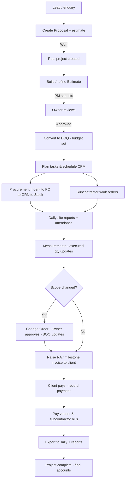

# BuildFlow - Product Overview

**For company owners, directors, managers, and anyone who uses or evaluates BuildFlow.**

This guide explains, in plain language, **what BuildFlow does, who uses it, every feature it contains, and how the day-to-day flows work**. No technical knowledge is needed. It is written to help a construction business head understand the full product without reading any code.

Companion documents:
- [BUSINESS_GUIDE.md](./BUSINESS_GUIDE.md) - getting started, pricing, support, onboarding checklist
- [ESTIMATES.md](./ESTIMATES.md) - detailed guide to the estimation and BOQ process
- [TECHNICAL_OVERVIEW.md](./TECHNICAL_OVERVIEW.md) - for your IT team / developers

---

## Table of contents

1. [What BuildFlow is](#1-what-buildflow-is)
2. [Who uses BuildFlow (people & roles)](#2-who-uses-buildflow-people--roles)
3. [Every module, in plain English](#3-every-module-in-plain-english)
4. [The big picture: how a project flows end-to-end](#4-the-big-picture-how-a-project-flows-end-to-end)
5. [Money flows explained simply](#5-money-flows-explained-simply)
6. [Integrations: your company vs BuildFlow](#6-integrations-your-company-vs-buildflow)
7. [Settings & company administration](#7-settings--company-administration)
8. [What's ready vs still being polished](#8-whats-ready-vs-still-being-polished)
9. [Glossary of terms](#9-glossary-of-terms)
10. ["I want to…" quick index](#10-i-want-to-quick-index)

---

## 1. What BuildFlow is

BuildFlow is a **single software platform that helps an Indian construction firm run its entire business** — from the first cost estimate, to the site work, to the final invoice and accounts. It is designed for **small, medium, and large** contracting and civil-engineering companies.

It replaces the patchwork of Excel sheets, WhatsApp groups, paper measurement books, and separate accounting tools that most firms use today. Instead, everything lives in one connected system:

- **Estimate** a project's cost before you start.
- **Plan** the work schedule and tasks.
- **Run the site** with daily reports, attendance, and material tracking.
- **Buy materials** through proper indents, purchase orders, and stock.
- **Manage subcontractors** with work orders and measurement sheets.
- **Bill your clients** and **record vendor bills**, with GST and TDS handled correctly.
- **Export to Tally** for your books.
- **Ask the BuildFlow Assistant** questions in plain English about your projects and money.

The same app works on **mobile phones, tablets, and desktop computers (web browser)** — site supervisors use it on their phones, owners and accountants use it on a laptop.

Built by **Jora AI** (Hyderabad, India).

---

## 2. Who uses BuildFlow (people & roles)

Every person in your company gets a login with a **role**. The role decides what they can see and do. This keeps sensitive information (like company finances or salary details) visible only to the right people.

| Role | Who they are | What they can do |
|------|--------------|------------------|
| **Owner** | Director / company head | Everything: all projects, settings, billing, users, integrations, audit log. The only role that approves estimates, converts to BOQ, and approves change orders. |
| **PM** (Project Manager) | Project manager / estimator | Create projects and estimates, submit estimates for approval, plan tasks, raise invoices, see accounting. **Cannot** approve estimates or change company settings. |
| **Supervisor** | Site engineer / supervisor | Dashboard, their projects (site view), and daily reports. Logs work done, materials, attendance. Cannot edit estimates or accounting. |
| **Accountant** | Accounts / finance person | Dashboard, accounting (invoices, bills, payments, GST, TDS, Tally export), and reports. |

There is also a separate **BuildFlow Platform Admin** login — this is for **Jora AI / BuildFlow staff only**, not for construction companies. They help with trials, billing, and escalations.

### Rule of thumb
> Only the **Owner** manages company-wide things: settings, team invites, subscription billing, integrations, and the audit log. Everyone else works within their projects and modules.

---

## 3. Every module, in plain English

Below is a plain-language explanation of **every part of BuildFlow** — what it does and why it matters to your business.

### 3.1 Dashboard & Analytics

- **Owner/Accountant dashboard** — a one-screen summary of your company: active projects, revenue, outstanding invoices, vendor bills due, budget usage, and project health.
- **Project analytics** — per-project profit & loss, estimate vs actual spend, and progress.
- Helps you answer "How is the business doing?" and "Which projects are making or losing money?" in seconds.

### 3.2 Projects

- Create and track construction **projects** with a name, code, client, location, budget, and status (Planning, In Progress, On Hold, Completed, Cancelled).
- Each project has **tabs**: Overview, Estimate, BOQ, Planning, Reports, Procurement, Subcontract, Accounting, Portals.
- **Project members** — assign PMs and supervisors to specific projects so they only see what's relevant to them.
- **Soft delete** — projects are never truly destroyed; they're hidden but kept for audit.

### 3.3 Proposals (pre-project quoting)

- Before a project is official, you can create a **Proposal** — a quote you send to a prospective client.
- A proposal creates a **temporary project** so you can build an estimate for it.
- When you **win** the job, you "promote" the proposal into a real project — your estimate carries over.
- Statuses: Draft → In Review → Approved → Sent → Won / Lost / Archived.

### 3.4 Estimation & Rate Analysis

This is where you build **cost estimates** — the project's budget plan — before work begins. (Full detail in [ESTIMATES.md](./ESTIMATES.md).)

- **3-step wizard**: (1) Setup (name + margins), (2) Build (sections + line items, or load a template), (3) Review.
- **Cost types**: Material, Labour, Equipment, Subcontractor, Misc.
- **Margins**: add Overhead %, Contingency %, and Profit % on top of the line items.
- **GST** is calculated automatically based on each item's resource rate.
- **Rate Analysis library** — reusable composite rates (e.g. "RCC M25 footing") built from material + labour + equipment components, so estimators stay consistent.
- **Material Prices** — your company's master list of cement, steel, labour rates, etc., with GST and HSN codes.
- **Versions & comparison** — every estimate gets a version number (v1, v2…); you can compare two versions side by side to see what changed.
- **Approval workflow**: PM builds → submits → Owner **approves** or rejects. Only then can it become the project's BOQ.
- **Statuses**: Draft → Reviewed → Approved / Rejected → (older approved ones become) Superseded.

### 3.5 BOQ (Bill of Quantities)

- After an estimate is **approved**, the Owner **converts it to BOQ**.
- The BOQ is the **working quantity schedule** the team executes against on site.
- Each BOQ line tracks: contract quantity, **executed quantity** (done on site), and **procured quantity** (bought/purchased).
- Old BOQ lines are **archived** (not deleted) when a new estimate is converted — full history is kept.
- Converting to BOQ also **updates the project budget** to the approved estimate total.

### 3.6 Planning (tasks, schedule, dependencies)

- Break the project into a **Work Breakdown Structure (WBS)** — a hierarchy of phases and sub-phases.
- Add **tasks** under WBS items: start/end dates, duration, progress %, assigned person, status (Not Started, In Progress, Completed, Delayed, On Hold).
- **Dependencies** between tasks (Finish-to-Start, Start-to-Start, etc.) with optional lag days.
- **Milestones** mark key checkpoints.
- **Critical Path Method (CPM)** automatically calculates which tasks determine the project finish date.
- **Gantt / progress view** shows schedule health at a glance.

### 3.7 Daily Site Reports

- Supervisors submit a **Daily Report** for each project: work done, materials used, issues, photos, worker count, weather, site status.
- One report per project per day (no duplicates).
- Material usage can be linked to specific tasks and BOQ items, which then updates the **executed quantities** automatically.
- PMs and Owners see updates flow to the dashboard.

### 3.8 Attendance & Check-in (geo-fence)

- Supervisors **check in** on site using their phone's location.
- The system records distance from the project location and whether they were **within the geo-fence**.
- Check-out is recorded too — giving you a verifiable attendance log per site.

### 3.9 Procurement (buying materials)

A proper, auditable chain for buying materials:

1. **Indent (Material Requisition)** — site raises a request for materials (quantity, expected rate).
2. **Purchase Order (PO)** — the request becomes a formal PO to a vendor.
3. **Goods Receipt Note (GRN)** — when material arrives, record receipt against the PO.
4. **Stock** — material goes into your site or company **stock** (Stock Locations, Balances, Movements in/out/adjust).

This keeps your **procured quantities** on BOQ items up to date and prevents over- or under-ordering.

### 3.10 Subcontractors

- Maintain a **directory of subcontractors** (with GSTIN, contact, default TDS rate).
- Issue **Work Orders** with scope, contract value, retention %, and advance amount.
- **Measurement sheets** — periodically record the work the subcontractor has done.
- On **approval** of a measurement, BuildFlow **automatically creates a vendor Bill** (with retention held back) — no manual double entry.
- When a work order is **completed**, the **retention is released** as a final bill.
- Subcontractors can be given **portal access** to view their own work orders and measurements.

### 3.11 Change Orders (Variations)

- When scope or quantities change after the BOQ is frozen, the PM creates a **Change Order** (Variation).
- It captures the **cost impact** and **schedule impact (days)**.
- The **Owner approves** (or rejects with a reason).
- On approval, the **BOQ and project budget update automatically**.
- Change orders can be linked to specific tasks or subcontract work orders.

### 3.12 Accounting — Invoices (money in)

- Create **invoices to your clients** from a project.
- **GST handled correctly**: intra-state splits into CGST + SGST; inter-state becomes IGST. HSN/SAC codes per line.
- **TDS** deduction supported.
- **Three invoice types**:
  - **Standard** — a regular one-time invoice.
  - **Running Account (RA)** — cumulative progress billing with certified quantities, retention %, and running totals (previous / current / cumulative). Generates an **RA bill PDF** and **measurement book** for audit.
  - **Milestone** — billed against a project milestone.
- **Payments**: record client payments; optionally send a **payment link** (Razorpay for India, Stripe for international) if your company has connected those integrations.
- **Statuses**: Draft → Sent → Paid / Overdue.

### 3.13 Accounting — Bills (money out)

- Record **vendor and supplier bills** with GST and TDS where applicable.
- Bills can be linked to a **Purchase Order**, a **subcontract work order**, or a **measurement**.
- Track **retention** withheld, **advance recovery**, and **paid amount** per bill.
- **Retention release** bills are generated automatically when a subcontract work order completes.
- **Statuses**: Pending → Approved → Paid (or Rejected).

### 3.14 Accounting — Tally Export

- Export your project **invoices and bills as Tally-compatible XML** from **Project Accounting** or **Reports Hub → Export to Tally**.
- **Map ledger names** in **Settings → Integrations** (Sales, Purchase, GST, TDS, Retention, Advance Recovery, Bank) so the export matches your chart of accounts in Tally Prime.
- Saves your accountant from re-entering data.

### 3.15 Journal Entries

- **Double-entry journal records** are created **automatically** for key payment events when integrations are active.
- Provides an audit trail for accountants and auditors.

### 3.16 Notifications

- In-app **notifications** for important events (invoice due, task overdue, approval needed, trial expiring).
- Optional **WhatsApp / SMS** (via Twilio) and **push notifications** (Expo) when configured.
- Each user has their own notification list; read/unread tracking.

### 3.17 BuildFlow Assistant (AI)

- A floating **assistant button** (bottom-right) opens a chat overlay on web and mobile.
- Ask in **English or Hinglish**: "What's the status of project X?", "Show overdue tasks", "How much GST did we collect this month?", "What's the outstanding on client Y?".
- The assistant uses **your live project data** to answer.
- You can use BuildFlow's default AI, or connect **your own AI key** (BYOK) in Integrations.

### 3.18 Client Portal & Subcontractor Portal

- **Client portal** — generate a secure, time-limited link for a client to view project progress, invoices, and make a payment. The client doesn't need a login — they use the token link.
- **Subcontractor portal** — give a subcontractor scoped access to see only their work orders and measurement sheets.
- Links have **scopes** (what they can see) and **expiry dates**.

### 3.19 Reports & Exports

- **PDF reports** — 12 downloadable reports (project financials, GST summary, TDS, P&L, etc.).
- **Excel exports** — estimates, BOQ, accounting data for offline work.
- **Data Export** — the Owner can download a **full backup** of company data (zip).
- **Scheduled reports** — set up recurring reports (GST summary, TDS, dashboard) emailed to recipients on a schedule.

### 3.20 Settings (Owner only, mostly)

| Setting | What it's for |
|---------|---------------|
| **My Profile** | Update your name, phone; request role/email changes via support ticket |
| **Company Profile** | Company name, GSTIN, PAN, address, logo |
| **Users & Roles** | Invite team members, assign roles, revoke access |
| **Billing & plan** | See trial status, upgrade plan, pay subscription |
| **Material Prices** | Your company's resource & rate library |
| **Rate Regions** | Set up location-based material pricing |
| **Rate Analysis Library** | Reusable composite rate templates |
| **Manage Integrations** | Connect WhatsApp, Razorpay, Stripe, Tally, Maps, AI, Storage |
| **Audit Log** | Who changed what, when (compliance) |
| **Support Requests** | Raise tickets for help (profile, billing, integrations, bugs) |
| **Data Export** | Download a company backup |
| **Help Center** | In-app guidance and next-step tips |

---

## 4. The big picture: how a project flows end-to-end

Here's the complete journey of a construction project inside BuildFlow, from lead to final accounts.

### Step-by-step story

1. **A lead comes in.** You create a **Proposal** with a quick estimate to quote the client.
2. **You win.** The proposal is **promoted** to a real project; your estimate carries over.
3. **The PM builds a detailed estimate** using Material Prices and Rate Analysis, sets margins, and **submits** it.
4. **The Owner approves** the estimate. (If rejected, the PM edits and resubmits.)
5. **The Owner converts the approved estimate to BOQ.** This sets the **project budget** and creates the working quantity schedule.
6. **The PM plans the work**: WBS, tasks, dependencies, milestones. The system calculates the **critical path**.
7. **Materials are procured**: site raises an **Indent** → it becomes a **PO** → on delivery a **GRN** is recorded → stock updates → BOQ **procured quantities** update.
8. **Subcontractors are engaged** with work orders; they submit **measurement sheets** which, on approval, auto-create **bills** (with retention held).
9. **Supervisors file daily reports** from site — work done, materials used (linked to BOQ → **executed quantities** update), attendance via geo-fenced check-in.
10. **If scope changes**, the PM raises a **Change Order**; the Owner approves; BOQ and budget update.
11. **You bill the client** — typically a **Running Account (RA) invoice** with cumulative certified quantities and retention; or milestone invoices.
12. **The client pays** (optionally via a Razorpay/Stripe payment link); you **record the payment**.
13. **You pay vendors and subcontractors**; retention is released when work completes.
14. **The accountant exports to Tally**, generates **PDF reports**, and the **Owner reviews the dashboard** for project P&L.
15. **Project completes** — final accounts and full audit trail are preserved.

---

## 5. Money flows explained simply

Construction money can be confusing. Here's how BuildFlow thinks about it.

### 5.1 Money IN (from your clients)

- You raise an **Invoice** to the client.
- GST is added (CGST+SGST or IGST depending on states).
- The client pays; you record the **payment**.
- For long projects you use **RA billing**: each invoice shows **previous**, **current**, and **cumulative** certified amounts, with **retention** withheld until the end.

### 5.2 Money OUT (to your vendors & subcontractors)

- You receive a **Bill** from a vendor (materials, equipment, etc.).
- GST and TDS are applied where relevant.
- You approve and **pay** the bill.
- For subcontractors, **retention** (e.g. 5-10%) is held back on each measurement bill and **released** when the work order is completed.

### 5.3 Retention (explained)

Retention is a **percentage of payment withheld** until a job is fully done — it protects you against defective or incomplete work.

- On **client RA invoices**: you hold back retention % from the client (standard construction practice).
- On **subcontractor bills**: you hold back retention % from the subcontractor.
- When the work order **completes**, the held retention is **released** as a final bill.

### 5.4 GST basics (India)

- **Intra-state** (you and client in same state): GST splits into **CGST + SGST** (equal halves).
- **Inter-state** (different states): GST becomes **IGST** (single component).
- BuildFlow decides automatically based on your company state and the client's GSTIN state.
- Each material/resource has its own GST rate and **HSN/SAC code**.

### 5.5 TDS basics

- **TDS (Tax Deducted at Source)** is tax you deduct when paying a vendor/subcontractor (e.g. 1-2% for works contracts).
- BuildFlow tracks TDS rate and amount per bill; subcontractors have a **default TDS rate**.

### 5.6 "Committed" vs "Paid" spend

On the project summary and dashboard, you'll see two important numbers:

| Term | What it means |
|------|---------------|
| **Committed spend** | The total of all **approved and paid** vendor bills — money you **owe or have obligated**. |
| **Paid spend** | The total of **paid amounts** on those bills — money that has actually **left your bank**. |
| **Budget utilization** | Committed spend as a percentage of the project **budget**. |

> **Why this matters:** Committed spend tells you your total exposure (even bills not yet paid). Paid spend tells you actual cash out. Budget utilization tells you if you're on track financially.

---

## 6. Integrations: your company vs BuildFlow

This is **one of the most important distinctions** to understand. There are two kinds of integrations, and mixing them up causes confusion about who pays whom.

### 6.1 Your company's integrations (YOU set these up)

These use **your firm's accounts** to talk to **your clients and vendors** — not to pay BuildFlow.

| Integration | What it does for your business |
|-------------|-------------------------------|
| **WhatsApp & SMS (Twilio)** | Send invoice links and payment reminders to **your clients** |
| **Razorpay** | Let **your clients** pay **your invoices** online (India) |
| **Stripe** | International client payments on **your invoices** |
| **Tally** | Map ledger names so exports fit **your books** |
| **Google Maps** | Site location, navigation, attendance check-in |
| **AI Assistant (BYOK)** | Use **your own** AI provider instead of BuildFlow's default |
| **File storage (BYOK)** | Store uploads in **your own** cloud bucket |

**Who sets these up:** The **Owner**, under **Settings → Manage Integrations**. Need help? Raise an **Integration Setup** support ticket.

### 6.2 BuildFlow platform services (BuildFlow runs these)

These run the product itself. **Your team does NOT configure these** in Integrations.

| Service | Purpose |
|---------|---------|
| Hosting & database | Keeps your data secure and available |
| BuildFlow Assistant (default) | AI help unless you override with your own |
| File storage (default) | Logos & site photos unless you use your own S3 |
| **BuildFlow subscription billing** | What **you pay BuildFlow** for the software (separate from Razorpay for client invoices!) |
| Platform admin | BuildFlow staff manage trials, escalations, enterprise accounts |

> ⚠️ **Important:** Paying a client through **your Razorpay** (in Integrations) is **NOT** the same as paying **BuildFlow** for your monthly subscription. Subscription billing is under **Settings → Billing & plan**.

### 6.3 Pricing (BuildFlow plans)

| Plan | Monthly (pre-GST) | Annual (pre-GST) | Best for |
|------|--------------------|-------------------|----------|
| **Inventory** | ₹499 / month | ₹4,990 / year | Stock & trading businesses — 1 store, procurement (Indent→PO→GRN), sales invoices, vendor bills, Tally export, 10 users |
| **Starter** | ₹1,999 / month | ₹19,990 / year | Small contractors — up to 3 projects, 5 team members |
| **Professional** | ₹4,999 / month | ₹49,990 / year | Growing firms — up to 25 projects, full GST/RA, CPM, procurement, portal, Assistant (500 queries/mo) |
| **Enterprise** | Contact sales | Contact sales | Large firms — dedicated support, custom integrations, unlimited Assistant (fair use) |

- **18% GST** is added on top (Indian billing).
- **14-day free trial** on signup — no card required.
- Reminders sent at **7, 3, and 1 day** before trial expiry.
- Upgrade via **Settings → Billing & plan**.

### 6.4 The Inventory product (BuildFlow Inventory)

A separate product for **stock & trading businesses** that don't need construction modules:

- Sign up from the pricing page **Inventory** card (or `/signup/company?product=inventory`).
- The app opens directly into the **Inventory shell**: **Stock · Procurement · Invoices · Bills · Settings** — no construction "Projects" navigator.
- Everything runs against one hidden **store** (`STORE` project) created automatically.
- **Stock** — on-hand balances, received/issued totals, movements per item.
- **Procurement** — Indent → Purchase Order → Goods Receipt (GRN) updates stock automatically.
- **Invoices** — client / sales invoices (AR); **Bills** — vendor bills (AP); both can be exported to **Tally**.
- **Team** — roles are limited to **Owner** and **Inventory Manager** (10 users max).
- **Assistant** — same BuildFlow AI, scoped to stock, POs, GRNs, invoices, bills, and Tally.

---

## 7. Settings & company administration

The **Owner** is responsible for company-wide configuration. Here's what each setting does and **when to use it**:

| Setting | When you'll use it |
|---------|--------------------|
| **My Profile** | Change your name/phone; request role or email change |
| **Company Profile** | When you first sign up; update GSTIN/address/logo |
| **Users & Roles** | Add/remove team members; assign PM/Supervisor/Accountant |
| **Billing & plan** | Check trial, upgrade, pay subscription, see invoices |
| **Material Prices** | Maintain cement/steel/labour rates; used in estimates & bills |
| **Rate Regions** | Set different prices for different cities/sites |
| **Rate Analysis Library** | Build reusable composite rates (e.g. "RCC M25") |
| **Manage Integrations** | Connect WhatsApp, Razorpay, Stripe, Tally, Maps, AI, Storage |
| **Audit Log** | Review who changed what (compliance, disputes) |
| **Support Requests** | Raise tickets: profile change, billing, integration setup, bugs, data fixes |
| **Data Export** | Download a full backup of company data (do this periodically) |
| **Help Center** | Learn how each workflow works, in plain language |

### Support ticket categories

Anyone can raise a ticket; the Owner resolves company-scope ones, and BuildFlow support handles platform-scope ones:

- **Profile / role change** — "Make me PM on all projects"
- **Company info change** — GSTIN or address update
- **Integration setup** — "Help connect WhatsApp Business"
- **Billing & subscription** — extend trial, upgrade, invoice query
- **Bug report** — something not working
- **Data correction** — fix wrong figures
- **Other** — general questions

---

## 8. What's ready vs still being polished

| Status | What's included |
|--------|-----------------|
| ✅ **Ready for use** | Login, trials, invites, projects, proposals, estimation, BOQ, planning (WBS/CPM), daily reports, attendance, procurement, subcontractors, change orders, accounting (invoices/bills/GST/TDS/RA/Tally), notifications, AI assistant, integrations UI, billing, support tickets, audit log, data export, client & subcontractor portals, marketing site, PDF/Excel reports |
| 🔄 **In progress (Phase 6)** | Further reports, deeper analytics, and UX refinements across desktop and mobile |

### The six implementation phases

1. ✅ **Phase 1** — Foundation: multi-tenant auth, roles, company setup
2. ✅ **Phase 2** — Projects, WBS, Tasks, Gantt/CPM, BOQ
3. ✅ **Phase 2.5** — Rate Analysis, Estimates, Excel/PDF export
4. ✅ **Phase 3** — Daily reports, geo-fenced attendance, material usage
5. ✅ **Phase 4** — Invoices (incl. RA & Milestone), Bills, GST/TDS, Tally export, journals
6. ✅ **Phase 5** — Notifications, AI assistant, integrations, SaaS billing, tickets, audit, exports
7. 🔄 **Phase 6** — Reports, analytics polish, UX refinements

> **For production rollout:** Plan a short **pilot on 1-2 real projects** with Owner + PM + Supervisor + Accountant before company-wide adoption.

---

## 9. Glossary of terms

Construction and software both have jargon. Here's what everything means in plain English.

| Term | Plain-English meaning |
|------|------------------------|
| **BOQ** (Bill of Quantities) | The list of work items with quantities and rates — the "shopping list" for the project, created from an approved estimate |
| **Estimate** | A cost plan prepared before work starts — what the project *should* cost, including margins and GST |
| **Rate Analysis** | A composite rate built from materials + labour + equipment (e.g. the rate for "1 cubic meter of RCC M25") |
| **WBS** (Work Breakdown Structure) | A tree of project phases and sub-phases (e.g. Substructure → Foundation → Footing) |
| **CPM** (Critical Path Method) | The calculation that finds which tasks directly affect the project finish date |
| **Gantt** | A visual timeline of tasks |
| **Milestone** | A key checkpoint in a project (e.g. "Foundation complete") |
| **RA Bill** (Running Account bill) | A cumulative progress invoice — shows previous, current, and total work billed, with retention held |
| **Retention** | A % of payment withheld until the job is fully completed and verified |
| **Measurement Book (MB)** | An auditable record of measured quantities — used in RA billing for transparency |
| **GST** | Goods & Services Tax (India). Splits into CGST+SGST (same state) or IGST (different state) |
| **CGST / SGST / IGST** | Central / State / Integrated GST components |
| **TDS** | Tax Deducted at Source — tax you deduct when paying vendors |
| **HSN / SAC** | Codes that classify goods (HSN) and services (SAC) for GST |
| **GSTIN** | A company's GST identification number |
| **PAN** | A company's Permanent Account Number (income tax) |
| **Indent** (Material Requisition) | An internal request from site for materials |
| **PO** (Purchase Order) | A formal order to a vendor to supply materials/services |
| **GRN** (Goods Receipt Note) | Proof that materials were received against a PO |
| **Stock** | The materials you have on hand at a site or store |
| **Subcontractor** | An outside firm you hire to do part of the work (e.g. plumbing, electrical) |
| **Work Order** | The contract document issued to a subcontractor |
| **Change Order / Variation** | A formal change to scope/quantities after the BOQ is set |
| **Portal** | A secure link giving an outsider (client/subcontractor) limited, temporary access |
| **BYOK** | Bring Your Own Key — you provide your own API keys (e.g. for AI) |
| **Trial** | The free 14-day period after signup |
| **Dashboard** | The home screen with key summaries |
| **Audit Log** | A record of who changed what, when — for compliance |
| **SaaS** | Software as a Service — software you rent monthly/yearly (like BuildFlow) |
| **Tenant** | Your company's isolated space in BuildFlow — your data cannot be seen by other companies |

---

## 10. "I want to…" quick index

Common goals and where to find them:

| I want to… | Go to |
|------------|-------|
| See overall business health | **Dashboard** (Owner/Accountant) |
| Create a new project | **Projects → Create** (Owner/PM) |
| Quote a prospective client | **Proposals → Create** (Owner/PM) |
| Build a cost estimate | Open a project → **Estimate tab** → Create (PM) |
| Approve an estimate | Open the estimate → Approve (**Owner only**) |
| Convert estimate to BOQ | Estimate detail → Convert to BOQ (**Owner only**) |
| See/change the work schedule | **Planning** (PM) |
| Add a task | Project → **Planning/WBS** |
| Submit a daily site report | **Reports → Create** (Supervisor) |
| Check in on site | **Reports → Check-in** (Supervisor) |
| Request materials | Project → **Procurement → Indent** |
| Create a purchase order | Project → **Procurement → PO** |
| Record material received | Project → **Procurement → GRN** |
| Issue a subcontractor work order | Project → **Subcontract** |
| Approve a subcontractor measurement | Project → **Subcontract → Measurement** |
| Raise a client invoice (incl. RA) | **Accounting → Invoices → Create** (PM/Accountant) |
| Record a client payment | Open the invoice → Record payment |
| Record a vendor bill | **Accounting → Bills → Create** (Accountant) |
| Pay a vendor | Open the bill → Record payment |
| Export to Tally | **Project Accounting** or **Reports Hub** (XML download) |
| Download a PDF report | **Reports hub** or project |
| See how much we've spent | Project summary or **Dashboard** (committed vs paid) |
| Ask the AI a question | Floating **Assistant** button (bottom-right) |
| Invite a team member | **Settings → Users & Roles** (Owner) |
| Connect WhatsApp/Razorpay | **Settings → Integrations** (Owner) |
| See who changed what | **Settings → Audit Log** (Owner) |
| Get help / raise a ticket | **Settings → Support Requests** |
| Back up company data | **Settings → Data Export** (Owner) |
| Check my trial / pay subscription | **Settings → Billing & plan** (Owner) |
| Give a client a progress link | Project → **Portals → Client access** |
| Give a subcontractor a link | Project → **Portals → Subcontractor access** |

---

## Summary

BuildFlow lets a construction company head:

1. **Start on a trial** without any IT setup.
2. **Invite the right people** with clear, role-based access.
3. **Run projects** from estimate → BOQ → plan → site → invoice in one connected system.
4. **Keep finance GST-aware** (with RA billing, TDS, and Tally export).
5. **Buy materials** and **manage subcontractors** with proper audit trails.
6. **Connect your own** payment and WhatsApp accounts for client communication.
7. **Stay in control** via the audit log, data exports, and owner-only settings.

For technical setup (servers, databases, deployment), refer your IT team to the [Technical Overview](./TECHNICAL_OVERVIEW.md) and the developer **README**.

---

*Last updated: June 2026 · Reflects current product capabilities including proposals, procurement, subcontracting, portals, RA billing, change orders, integrations, SaaS billing, support tickets, and platform admin.*